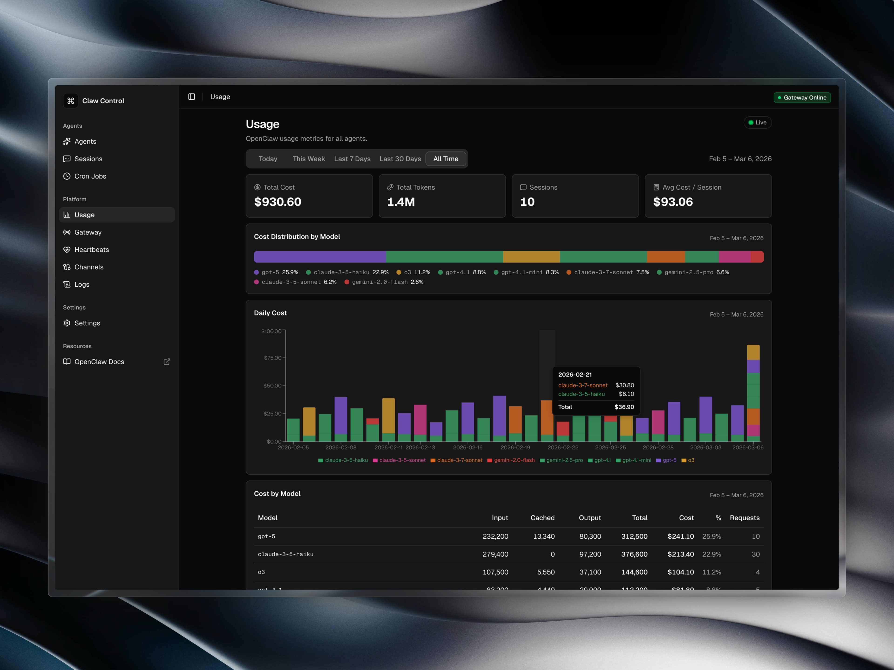

# Claw Control

Claw Control is a plug-and-play dashboard for monitoring a local [OpenClaw](https://github.com/zenvalabs/openclaw) instance.



## System Requirements

- [Node.js](https://nodejs.org/) and [npm](https://www.npmjs.com/)
- A machine that already has OpenClaw running or has OpenClaw data available locally

## Setup Steps

Follow these steps to setup Claw Control:

### 1. Clone the repository

Make sure you clone the repository onto the machine that has OpenClaw running or has OpenClaw data available locally.

```bash
git clone https://github.com/zenva-labs/claw-control.git
```

### 2. Install dependencies

```bash
cd claw-control
npm install
```

### 3. Point the application to your OpenClaw data

By default, Claw Control will look for your OpenClaw data in `~/.openclaw` which is OpenClaw's default data location. If your OpenClaw data is not in this location, follow the instructions in the [Environment Variables & Configuration](#environment-variables--configuration) section to set `OPENCLAW_DIR` to the full path to your OpenClaw data.

### 4. Build and run Claw Control

```bash
npm run build
npm start
```

## Environment Variables & Configuration

Once you've installed dependencies and pointed the application to your OpenClaw data, you can build and run Claw Control. If you need to configure the application, you'll need to create a `.env` file from the sample environment file:

```bash
cp .env.sample .env
```

Then, you can set the following environment variables:

- `OPENCLAW_DIR`: Full path to your OpenClaw directory.

## Security

Claw Control does not provide authentication or authorization out of the box. Securing access to Claw Control is the responsibility of the individual running it.

Depending on how you deploy it, Claw Control may be accessible to other people on the same network. You should restrict access appropriately for your environment, such as by limiting network exposure and placing it behind your own access controls.

It is also highly recommended that you run regular security audits on your OpenClaw instance. See the [OpenClaw security documentation](https://docs.openclaw.ai/cli/security#security) for guidance.

## Local Development

For local development, you can run the following commands after setting up your environment:

```bash
npm install
npm run dev
```
